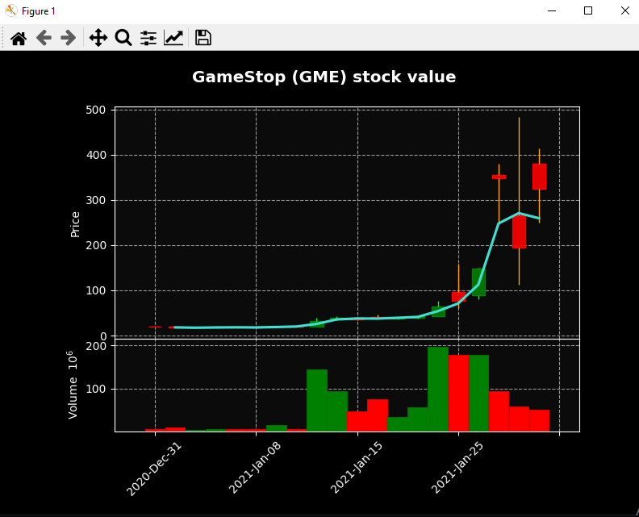
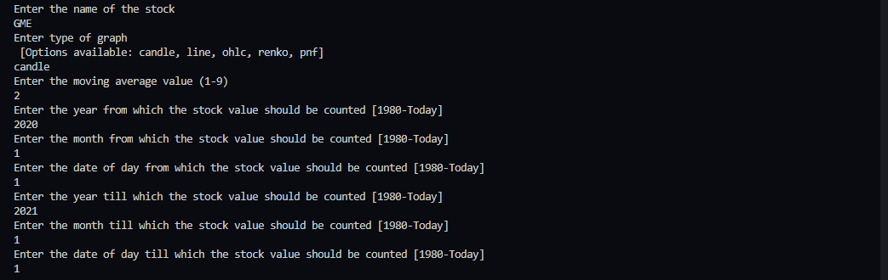

<p align="center">
    <br />
    Demo image of the application.
</p>

# Stock Value Checker

A Matplotlib application that checks the stock value of a user-set stock in a user-set timeframe.

# Features

-   Set the name of the desired stock
-   Set the time frame of stock measurement (start date - end date)
-   Set the MAV (Moving Average)
-   Set the type of graph (candle, line, ohlc, renko or pnf)
-   Set data source. (Default is the Yahoo API. Instead, a CSV file can also be used)
-   Graph ignores non-trading days
-   Shows volume

# Libraries Used

-   mplfinance
-   matplotlib
-   pandas_datareader
-   datetime

# How To Read the Different Graphs

## Candlestick

<br />

A candlestick chart is a style of financial chart used to describe price movements of a security, derivative, or currency. Each "candlestick" typically shows one day, thus a one-month chart may show the 20 trading days as 20 candlesticks.

-   Candlestick charts are used by traders to determine possible price movement based on past patterns.
-   Candlesticks are useful when trading as they show four price points (open, close, high, and low) throughout the period of time the trader specifies.
-   Many algorithms are based on the same price information shown in candlestick charts.
-   Trading is often dictated by emotion, which can be read in candlestick charts.
    [Read more](https://www.investopedia.com/trading/candlestick-charting-what-is-it/)

## Line

<br />
Self-explanatory. A line chart is a graphical representation of an asset's historical price action that connects a series of data points with a continuous line. This is the most basic type of chart used in finance and typically only depicts a security's closing prices over time. [Read more](https://www.investopedia.com/terms/l/linechart.asp)

## OHLC

<br />
An **O**pen-**H**igh-**L**ow-**C**lose chart is a type of chart typically used to illustrate movements in the price of a financial instrument over time. Each vertical line on the chart shows the price range over one unit of time, e.g., one day or one hour. [Read more](https://www.investopedia.com/terms/o/ohlcchart.asp)

## Renko

<br />
A Renko chart is a type of chart, developed by the Japanese, that is built using price movement rather than both price and standardized time intervals like most charts are. It is thought to be named after the Japanese word for bricks, "renga," since the chart looks like a series of bricks. [Read more](https://www.investopedia.com/terms/r/renkochart.asp)

## PNF

<br />
A **P**oint-**and**-**F**igure chart plots price movements for stocks, bonds, commodities, or futures without taking into consideration the passage of time.
PNF charts utilize columns consisting of stacked X's or O's, each of which represents a set amount of price movement. The X's illustrate rising prices, while O's represent a falling price.
[Read more](https://www.investopedia.com/terms/p/pointandfigurechart.asp)

# To Clone

```
git clone https://github.com/AdityaBhattacharya1/Stock-Value-Checker
```

`cd` into project directory <br />

```
pip install -r requirements.txt
python main.py
```

# Usage

After running `python main.py` in a command prompt, you will be asked to enter the various values of the attributes.
<br /><br />


# License

Distributed under the MIT License. See `LICENSE` for more information.

## Sources

For the explanation of the different types of graphs:

-   Investopedia.com
-   Wikipedia

For the images:

-   perkinselearning.org
-   datavizcatalogue.com
